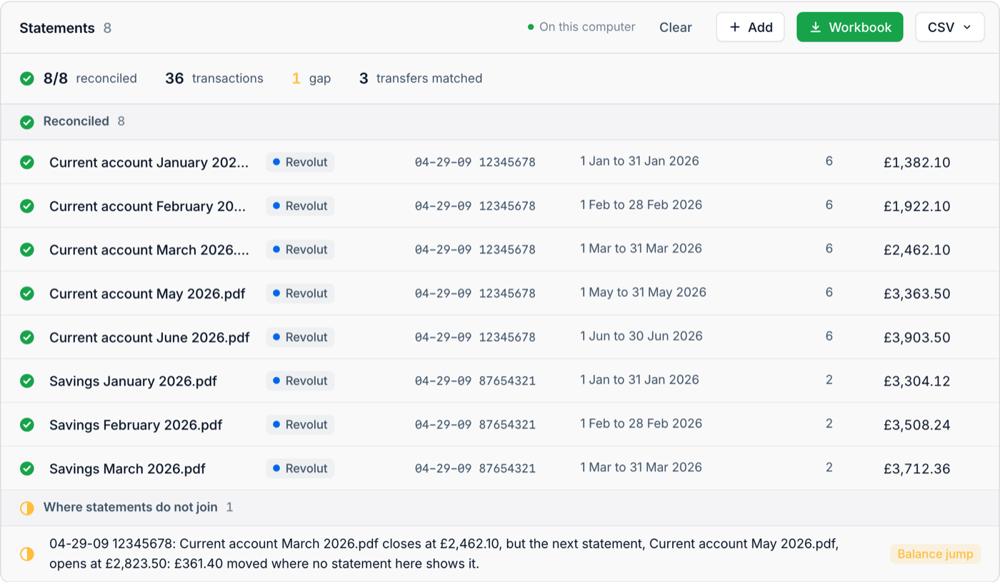
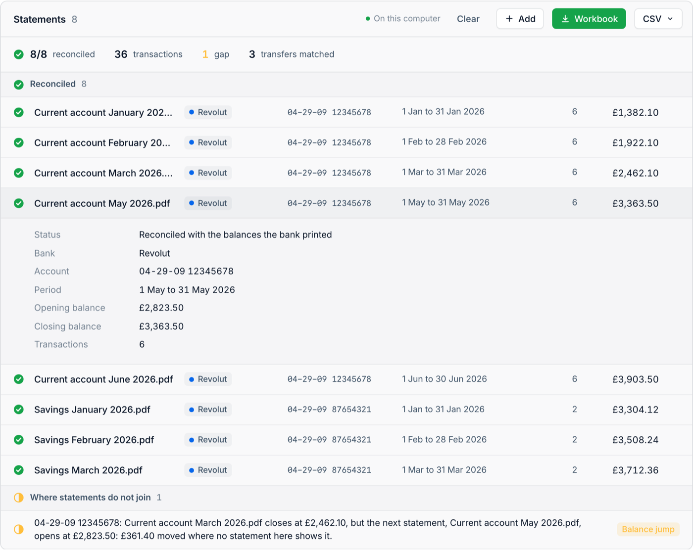

# tothepenny

**Does it add up?** Drop in PDF bank statements. tothepenny reads every line, checks it against the balances the
bank printed, and hands you a spreadsheet. A statement that doesn't add up is listed with the reason, and its
transactions are left out.

**[Try it in your browser](https://paultendo.github.io/tothepenny/)** · [How it works](https://paultendo.github.io/posts/tothepenny/) · [Buy me a coffee](https://buymeacoffee.com/paultendo)

<picture>
  <source media="(prefers-color-scheme: dark)" srcset="docs/images/results-dark.png">
  
</picture>

<sub>Invented statements. April is missing, and the balance jump shows it.</sub>

## How it checks

A statement records the same money twice, once as transactions and once as balances. tothepenny uses the balances
as the bank's own checksum. The opening balance has to reach the closing balance, every running or day-end balance
printed on the way has to be met, and the check has to rest on figures the bank printed, never on ones tothepenny
calculated for itself. Across more than a thousand real statements in testing, three quarters of all transactions were
checked individually against a printed balance, and the rest at the end of each day.

With several statements, it lines each account up in date order and says where they don't join: a missing month, a
balance that jumps, the same statement twice. Transfers between accounts in the set are matched when the statements
show it's the same money.

The [article](https://paultendo.github.io/posts/tothepenny/) goes further, including how other tools compare.

## In your browser

The [browser version](https://paultendo.github.io/tothepenny/) runs the same Python as the command line, in your
tab, with PDFium compiled to WebAssembly and Pyodide. Your statements never leave your computer, and the downloads
are made in the tab. It can't read scanned statements yet; the command line can, with Tesseract.

To host it yourself, `python3 web/build.py` writes the site to `web/dist` for any static host.

## Banks

Barclays, Halifax, HSBC and first direct, Lloyds, Metro Bank, Monzo, Nationwide, NatWest, Revolut, Santander and
TSB, plus Crédit Agricole and LCL in France and PagSeguro in Brazil. A statement from anywhere else is reported as
not recognised. New banks and layouts are the most useful contribution: see [CONTRIBUTING.md](CONTRIBUTING.md).

## Command line

Python 3.10 or later. PDFium comes with the package through pypdfium2; scanned statements also need Tesseract.

```bash
pip install -e .
```

```bash
tothepenny extract statement.pdf           # one statement
tothepenny batch statements/ -o output/    # a folder of them
tothepenny banks                           # the banks it reads
```

A batch writes `statements.xlsx`, with every transaction, every statement and whether it reconciled, the gaps and
the transfers, and the same as CSV files.



## Licence

Copyright (C) 2026 Paul Wood FRSA ([@paultendo](https://github.com/paultendo)). Free under the
[GNU Affero General Public License v3.0](LICENSE), or under a [commercial licence](COMMERCIAL.md) for products and
services that can't take on the AGPL's obligations. Contributions are accepted under the
[Contributor Licence Agreement](CLA.md).

tothepenny reads statements; any conclusions are yours. Check anything you rely on against the original. It comes
without warranty.
